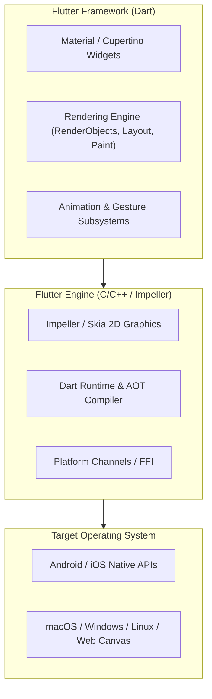
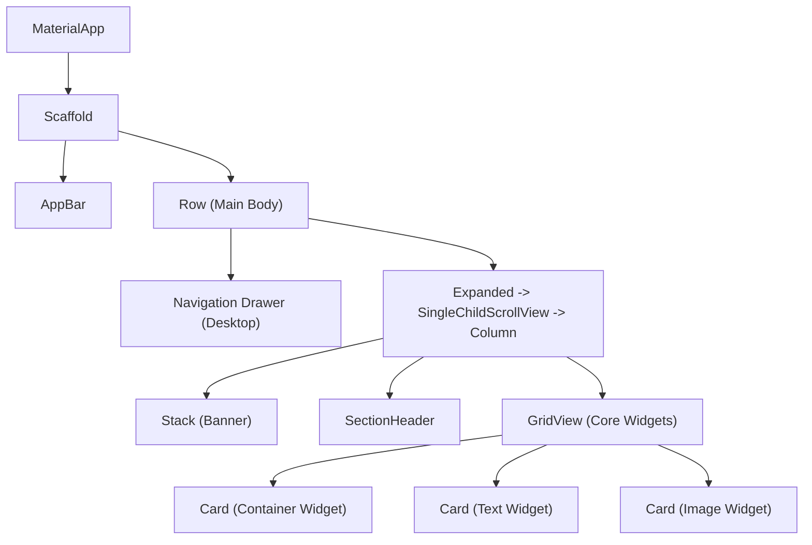
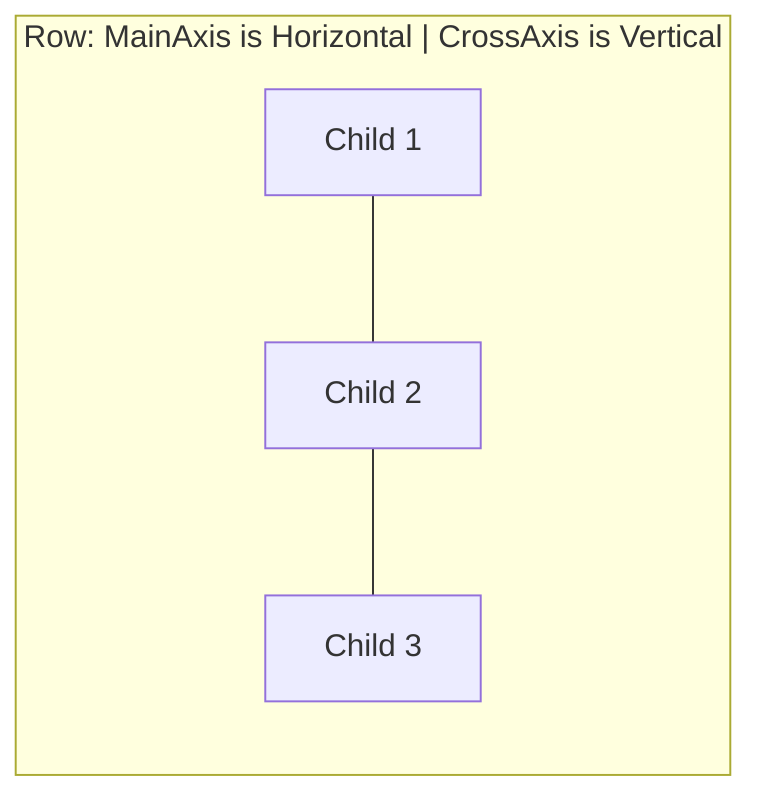
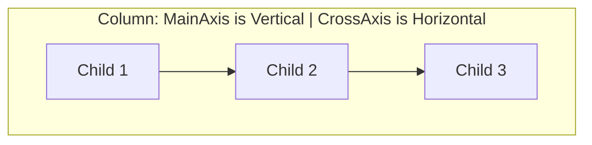

# Complete Guide to Flutter & Dart: Installation, Core Basics, Layouts, and Responsive UI Architecture

A comprehensive, production-grade guide covering everything from setting up the Flutter and Dart SDK to mastering core widgets, flex layouts (`Row`, `Column`, `Stack`), and engineering fully responsive multiplatform interfaces with `MediaQuery` and `LayoutBuilder`.

---

## Table of Contents
1. [Module 1: Flutter & Dart SDK Installation & Environment Setup](#module-1-flutter--dart-sdk-installation--environment-setup)
   - [1.1 Architecture & How Flutter Works with Dart](#11-architecture--how-flutter-works-with-dart)
   - [1.2 Step-by-Step Installation for macOS, Windows & Linux](#12-step-by-step-installation-for-macos-windows--linux)
   - [1.3 Running `flutter doctor` & Resolving Common Issues](#13-running-flutter-doctor--resolving-common-issues)
   - [1.4 IDE Configuration (VS Code & Android Studio)](#14-ide-configuration-vs-code--android-studio)
2. [Module 2: Dart Language Fundamentals (With Runnable Code)](#module-2-dart-language-fundamentals-with-runnable-code)
   - [2.1 Variables, Data Types & Type Inference](#21-variables-data-types--type-inference)
   - [2.2 Sound Null Safety](#22-sound-null-safety)
   - [2.3 Collections & Modern Collection Operators](#23-collections--modern-collection-operators)
   - [2.4 Functions & Higher-Order Methods](#24-functions--higher-order-methods)
   - [2.5 Object-Oriented Programming (Classes, Mixins, Inheritance)](#25-object-oriented-programming-classes-mixins-inheritance)
   - [2.6 Asynchronous Programming (`Future`, `async`/`await`)](#26-asynchronous-programming-future-asyncawait)
   - [2.7 Verified Runnable Dart Program & Output](#27-verified-runnable-dart-program--output)
3. [Module 3: Core Flutter Widgets Exploration](#module-3-core-flutter-widgets-exploration)
   - [3.1 The Flutter Widget Tree Hierarchy](#31-the-flutter-widget-tree-hierarchy)
   - [3.2 Stateless vs Stateful Widgets](#32-stateless-vs-stateful-widgets)
   - [3.3 Deep Dive into Fundamental Widgets](#33-deep-dive-into-fundamental-widgets)
4. [Module 4: Layout Structures & Flex Architecture](#module-4-layout-structures--flex-architecture)
   - [4.1 The Golden Rule of Flutter Layout](#41-the-golden-rule-of-flutter-layout)
   - [4.2 Linear Flex: `Row` & `Column`](#42-linear-flex-row--column)
   - [4.3 Proportional Sizing: `Expanded` vs `Flexible`](#43-proportional-sizing-expanded-vs-flexible)
   - [4.4 Layered Overlays: `Stack` & `Positioned`](#44-layered-overlays-stack--positioned)
   - [4.5 Adaptive Wrapping: `Wrap` & `SizedBox`](#45-adaptive-wrapping-wrap--sizedbox)
5. [Module 5: Designing Responsive & Adaptive UIs](#module-5-designing-responsive--adaptive-uis)
   - [5.1 Responsive vs. Adaptive: Core Principles](#51-responsive-vs-adaptive-core-principles)
   - [5.2 Defining Clean Breakpoint Systems](#52-defining-clean-breakpoint-systems)
   - [5.3 Harnessing `MediaQuery`](#53-harnessing-mediaquery)
   - [5.4 Granular Control with `LayoutBuilder`](#54-granular-control-with-layoutbuilder)
   - [5.5 Adaptive Multiplatform Navigation Architecture](#55-adaptive-multiplatform-navigation-architecture)
   - [5.6 Complete Production-Ready Application Code](#56-complete-production-ready-application-code)
6. [Module 6: Verification, Testing & Running the Projects](#module-6-verification-testing--running-the-projects)

---

## Module 1: Flutter & Dart SDK Installation & Environment Setup

### 1.1 Architecture & How Flutter Works with Dart
Flutter is Google's UI toolkit for building natively compiled applications across Mobile (iOS, Android), Desktop (macOS, Windows, Linux), and Web from a single codebase.



- **Dart**: The programming language providing Ahead-Of-Time (AOT) compilation to native ARM/x64 machine code for blazing-fast production performance, and Just-In-Time (JIT) compilation with State Hot Reload for sub-second development cycles.
- **Flutter SDK**: The widget library, rendering pipeline, asset packager, and CLI toolchain. The Dart SDK is bundled directly inside the Flutter SDK, so installing Flutter automatically installs Dart.

---

### 1.2 Step-by-Step Installation for macOS, Windows & Linux

#### A. macOS Installation (Apple Silicon & Intel)
1. **Download the Flutter SDK**:
   Visit [flutter.dev/docs/get-started/install/macos](https://docs.flutter.dev/get-started/install/macos) and download the bundle matching your CPU architecture (Apple Silicon `arm64` or Intel `x64`).
   Alternatively, clone via Git:
   ```bash
   mkdir -p ~/development
   cd ~/development
   git clone https://github.com/flutter/flutter.git -b stable
   ```

2. **Add Flutter to your PATH**:
   Open your shell profile (typically `~/.zshrc` on modern macOS):
   ```bash
   nano ~/.zshrc
   ```
   Add the following export line (adjust path to where you placed Flutter):
   ```bash
   export PATH="$PATH:$HOME/development/flutter/bin"
   ```
   Apply the changes:
   ```bash
   source ~/.zshrc
   ```

3. **Verify the Installation**:
   ```bash
   which flutter
   flutter --version
   dart --version
   ```

#### B. Windows Installation
1. **Download the Windows Zip Bundle**:
   Download `flutter_windows_<version>-stable.zip` from [flutter.dev](https://docs.flutter.dev/get-started/install/windows).
   Extract to a dedicated development path, such as:
   `C:\src\flutter` (Avoid installing in `C:\Program Files\` to prevent privilege elevation issues).

2. **Update User Environment Variables**:
   - Press the Windows Key and search for **"Edit the system environment variables"**.
   - Click **Environment Variables...**.
   - Under **User variables**, select `Path` and click **Edit**.
   - Click **New** and add: `C:\src\flutter\bin`.
   - Click **OK** to save.

3. **Verify in PowerShell / Command Prompt**:
   ```powershell
   flutter --version
   dart --version
   ```

#### C. Linux Installation
1. Install system prerequisites:
   ```bash
   sudo apt-get update
   sudo apt-get install -y curl git unzip xz-utils zip libglu1-mesa
   ```
2. Download and extract:
   ```bash
   sudo tar -xf flutter_linux_*-stable.tar.xz -C /opt/
   ```
3. Update `~/.bashrc`:
   ```bash
   export PATH="$PATH:/opt/flutter/bin"
   ```
   Reload: `source ~/.bashrc`.

---

### 1.3 Running `flutter doctor` & Resolving Common Issues
Execute the diagnostics command:
```bash
flutter doctor
```

`flutter doctor` scans your host machine for required toolchains:

| Diagnostic Check | Requirement | Remediation Command |
| :--- | :--- | :--- |
| **Android Toolchain** | Android Studio + Command-line tools | Open Android Studio -> SDK Manager -> SDK Tools -> Check **"Android SDK Command-line Tools"**. Run: `flutter doctor --android-licenses` |
| **Xcode (macOS only)** | Full Xcode installed for iOS/macOS | `sudo xcode-select --switch /Applications/Xcode.app/Contents/Developer`<br>`sudo xcodebuild -runFirstLaunch` |
| **CocoaPods (macOS)** | iOS dependency manager | `sudo gem install cocoapods` or `brew install cocoapods` |
| **Chrome / Web** | Google Chrome for web debugging | Installed automatically if Chrome is present. |

---

### 1.4 IDE Configuration (VS Code & Android Studio)
- **Visual Studio Code**:
  1. Open VS Code.
  2. Press `Cmd + Shift + X` (macOS) or `Ctrl + Shift + X` (Windows/Linux) to open Extensions.
  3. Install the official **Flutter** extension (by Dart-Code). This automatically installs the **Dart** extension.
  4. Press `Cmd + Shift + P` -> Select **Flutter: Run Flutter Doctor** to verify editor integration.
- **Android Studio / IntelliJ**:
  1. Open Plugins (`Settings` / `Preferences` -> `Plugins`).
  2. Search and install **Flutter** (Marketplace).
  3. Restart IDE.

---

## Module 2: Dart Language Fundamentals (With Runnable Code)

Dart is an object-oriented, class-based, garbage-collected language with C-style syntax, sound null safety, and powerful collection features.

### 2.1 Variables, Data Types & Type Inference
Dart is strongly typed, but provides smart type inference via `var`:

```dart
// Explicit Type Declaration
int userAge = 24;
double temperature = 98.6;
String username = 'Alex';
bool isActive = true;

// Type Inference with 'var' (Type is inferred at compile time as String)
var frameworkName = 'Flutter';

// Immutability: 'final' vs 'const'
final DateTime appStartedAt = DateTime.now(); // Evaluated at RUNTIME, assigned once
const double gravity = 9.80665;              // Evaluated at COMPILE-TIME
```

### 2.2 Sound Null Safety
Dart uses sound null safety, meaning variables cannot be `null` unless explicitly marked:

```dart
String nonNullable = "Always present"; // nonNullable = null; -> COMPILE ERROR!
String? nullableString;               // Defaults to null

// 1. Fallback operator (??)
String display = nullableString ?? 'Default Value';

// 2. Null-aware assignment (??=)
nullableString ??= 'Assigned if null';

// 3. Null-aware method/property access (?.)
int? length = nullableString?.length;

// 4. Null assertion operator (!) - Use ONLY when 100% certain it is non-null
int assuredLength = nullableString!.length;
```

### 2.3 Collections & Modern Collection Operators
Dart provides first-class support for `List`, `Set`, and `Map`:

```dart
// List (ordered array)
List<String> coreWidgets = ['Text', 'Container', 'Row', 'Column'];

// Set (unique collection)
Set<int> uniqueIds = {101, 102, 103, 101}; // Duplicates automatically removed

// Map (key-value dictionary)
Map<String, dynamic> appConfig = {
  'version': '1.0.0',
  'debugMode': false,
  'maxRetries': 3,
};

// Modern Collection 'if', 'for', and Spread (...) operator
bool includeAdminTab = true;
List<String> navigationItems = [
  'Dashboard',
  'Analytics',
  if (includeAdminTab) 'Admin Console',
  ...coreWidgets.map((w) => 'Widget: $w'),
];
```

### 2.4 Functions & Higher-Order Methods
Dart supports positional parameters, optional named parameters, default values, and arrow functions:

```dart
// Named parameters with 'required' & default value
void configureUserProfile({
  required String userId,
  String role = 'Member',
  bool sendWelcomeEmail = true,
}) {
  print('User $userId registered as $role (Email: $sendWelcomeEmail)');
}

// Arrow function syntax for single-expression functions
int calculateArea(int width, int height) => width * height;

// Higher-order functional methods (.where, .map, .fold)
List<int> rawScores = [10, 25, 40, 55, 60];
List<int> highScoresDoubled = rawScores
    .where((score) => score >= 30) // Filter
    .map((score) => score * 2)     // Transform
    .toList();                     // Result: [80, 110, 120]
```

### 2.5 Object-Oriented Programming (Classes, Mixins, Inheritance)
Dart supports full object-oriented capabilities, including constructor parameter shortcuts, inheritance, abstract classes, and mixins:

```dart
// Mixin for reusable behavior across distinct class hierarchies
mixin Auditable {
  void auditLog(String message) {
    print('[AUDIT - ${DateTime.now().toIso8601String()}]: $message');
  }
}

// Abstract base class
abstract class Device {
  final String deviceId;
  final String model;

  Device({required this.deviceId, required this.model});

  void connect();
}

// Concrete class inheriting base class and composing mixin
class SmartPhone extends Device with Auditable {
  final double screenDiagonalInches;

  SmartPhone({
    required super.deviceId,
    required super.model,
    required this.screenDiagonalInches,
  });

  @override
  void connect() {
    print('Connecting $model (ID: $deviceId) to wireless cellular network.');
    auditLog('Connection established successfully.');
  }
}
```

### 2.6 Asynchronous Programming (`Future`, `async`/`await`)
Dart is single-threaded using an event loop. Non-blocking asynchronous I/O is handled cleanly with `Future`, `async`, and `await`:

```dart
Future<Map<String, dynamic>> fetchTelemetryData(String deviceId) async {
  // Simulate network latency of 1 second
  await Future.delayed(const Duration(seconds: 1));
  
  return {
    'deviceId': deviceId,
    'batteryPercentage': 87,
    'signalStrengthDbm': -65,
    'status': 'Online',
  };
}
```

---

### 2.7 Verified Runnable Dart Program & Output

The companion source file is stored at:
[dart_basics_demo.dart](file:///Users/basith/.gemini/antigravity-ide/scratch/flutter_dart_guide/dart_basics_demo.dart)

To execute this program from your terminal:
```bash
dart /Users/basith/.gemini/antigravity-ide/scratch/flutter_dart_guide/dart_basics_demo.dart
```

#### Actual Terminal Execution Output:
```text
====================================================
          WELCOME TO DART BASICS MASTERCLASS         
====================================================

--- 1. Variables & Types ---
Developer: Basith, Age: 22, Height: 5.9 ft
Framework: Flutter (Active: true)
Executed at: 2026-09-10 16:38:20.023594 | Constant PI: 3.14159

--- 2. Sound Null Safety ---
Non-nullable: Always has a value
Nullable before assignment: null
Fallback with ??: Guest User
Nullable after ??=: Assigned Default Value
Length via ?.: 22

--- 3. Collections & Collection Operators ---
Widgets List: [Text, Container, Row, Column, Stack]
Unique IDs Set: {101, 102, 103}
Config Map: {appName: FlutterResponsiveApp, version: 1.0, supportedPlatforms: [Android, iOS, Web, Desktop]}
Dynamic Navigation Items: [Home, Profile, Settings, Widget: Text, Widget: Container]

--- 4. Functions & Functional Methods ---
Hello, Basith! Role assigned: Software Engineer
Original numbers: [1, 2, 3, 4, 5, 6]
Even squares: [4, 16, 36]

--- 5. Object-Oriented Programming (OOP) ---
Hi, I am Basith (ID: DEV-001).
Specialization: Dart Development.
Core competencies: Flutter, State Management, Responsive Design
Basith is actively coding high-performance Flutter widgets!
[AUDIT LOG 2026-09-10T16:38:20.028493] Action: Built responsive layout structure

--- 6. Asynchronous Programming (Async/Await) ---
Fetching simulated API data...
API Response Received: {userId: DEV-001, status: Active, reputationScore: 98.5, lastLogin: 2026-09-10T16:38:20.633349}

====================================================
         DART BASICS COMPLETED SUCCESSFULLY         
====================================================
```

---

## Module 3: Core Flutter Widgets Exploration

### 3.1 The Flutter Widget Tree Hierarchy
In Flutter, **"Everything is a Widget"**. The UI is a reactive tree of immutable configuration blueprints:



Under the hood, Flutter maintains three trees:
1. **Widget Tree**: Lightweight, immutable declarations created on every rebuild.
2. **Element Tree**: The structural spine managing widget lifecycle and state preservation.
3. **RenderObject Tree**: Heavyweight objects that calculate layout geometry, handle hit testing, and paint pixels to the screen.

---

### 3.2 Stateless vs Stateful Widgets

```dart
// 1. StatelessWidget: Immutable UI configuration that does not change over time
class GreetingCard extends StatelessWidget {
  final String title;
  const GreetingCard({super.key, required this.title});

  @override
  Widget build(BuildContext context) {
    return Text(title, style: const TextStyle(fontWeight: FontWeight.bold));
  }
}

// 2. StatefulWidget: Manages mutable state across the widget's lifecycle
class InteractiveCounter extends StatefulWidget {
  const InteractiveCounter({super.key});

  @override
  State<InteractiveCounter> createState() => _InteractiveCounterState();
}

class _InteractiveCounterState extends State<InteractiveCounter> {
  int _counter = 0;

  void _increment() {
    setState(() {
      _counter++; // Triggers an optimized sub-tree re-render
    });
  }

  @override
  Widget build(BuildContext context) {
    return ElevatedButton(
      onPressed: _increment,
      child: Text('Count: $_counter'),
    );
  }
}
```

---

### 3.3 Deep Dive into Fundamental Widgets

#### 1. `Container` & `BoxDecoration`
The ultimate Swiss Army knife for styling, positioning, and decorating:
```dart
Container(
  width: 200,
  height: 100,
  margin: const EdgeInsets.all(16.0),     // Outer spacing
  padding: const EdgeInsets.symmetric(horizontal: 20, vertical: 12), // Inner spacing
  alignment: Alignment.center,
  decoration: BoxDecoration(
    gradient: const LinearGradient(
      colors: [Color(0xFF1E3A8A), Color(0xFF3B82F6)],
      begin: Alignment.topLeft,
      end: Alignment.bottomRight,
    ),
    borderRadius: BorderRadius.circular(16),
    border: Border.all(color: Colors.white, width: 2),
    boxShadow: [
      BoxShadow(
        color: Colors.blueAccent.withValues(alpha: 0.3),
        blurRadius: 10,
        offset: const Offset(0, 5),
      ),
    ],
  ),
  child: const Text('Styled Container', style: TextStyle(color: Colors.white)),
)
```

#### 2. `Text` & `TextStyle`
Formatting typography with precision:
```dart
Text(
  'Building Responsive Modern Applications',
  textAlign: TextAlign.center,
  maxLines: 2,
  overflow: TextOverflow.ellipsis, // Adds "..." if text exceeds maxLines
  style: TextStyle(
    fontSize: 22,
    fontWeight: FontWeight.w800,
    letterSpacing: 1.2,
    height: 1.4, // Line height multiplier
    color: Color(0xFF0F172A),
    shadows: [
      Shadow(color: Colors.black26, offset: Offset(1, 1), blurRadius: 2),
    ],
  ),
)
```

#### 3. `Image` & `ClipRRect`
Rendering remote or local media with fallback protection:
```dart
ClipRRect(
  borderRadius: BorderRadius.circular(12),
  child: Image.network(
    'https://picsum.photos/400/250',
    width: double.infinity,
    height: 180,
    fit: BoxFit.cover, // Ensures image fills bounds without distortion
    loadingBuilder: (context, child, loadingProgress) {
      if (loadingProgress == null) return child;
      return const Center(child: CircularProgressIndicator());
    },
    errorBuilder: (context, error, stackTrace) {
      return Container(
        color: Colors.grey.shade200,
        child: const Icon(Icons.broken_image, size: 40, color: Colors.grey),
      );
    },
  ),
)
```

#### 4. `Scaffold` & Layout Skeletons
Provides standard Material Design visual structure:
- `appBar`: Top toolbar
- `body`: Primary canvas
- `drawer`: Slide-out navigation menu
- `bottomNavigationBar`: Bottom tabs on mobile devices
- `floatingActionButton`: Prominent round call-to-action button

---

## Module 4: Layout Structures & Flex Architecture

### 4.1 The Golden Rule of Flutter Layout
To eliminate layout bugs and overflow errors, remember this foundational rule:

> **Constraints go down.** (Parent passes min/max width & height to child)<br>
> **Sizes go up.** (Child decides its size within those constraints)<br>
> **Parent sets position.** (Parent aligns and positions child in its coordinates)

---

### 4.2 Linear Flex: `Row` & `Column`





#### Alignment Properties:
- `mainAxisAlignment`:
  - `start`: Packs children at the start of the main axis.
  - `center`: Centers children along the main axis.
  - `end`: Packs children at the end.
  - `spaceBetween`: Distributes extra space evenly between children.
  - `spaceAround`: Distributes extra space around children (half space at edges).
  - `spaceEvenly`: Distributes equal space between and at edges.
- `crossAxisAlignment`:
  - `start`, `center`, `end`, `stretch` (stretches children to fill the cross axis).

---

### 4.3 Proportional Sizing: `Expanded` vs `Flexible`
When putting elements inside a `Row` or `Column`, placing unconstrained widgets will trigger yellow-and-black stripe `RenderFlex overflow` warnings. `Expanded` and `Flexible` solve this:

```dart
Row(
  children: [
    // 1. Fixed width widget
    Container(width: 80, height: 50, color: Colors.grey),
    
    const SizedBox(width: 10),

    // 2. Expanded takes 2 shares of remaining space
    Expanded(
      flex: 2,
      child: Container(height: 50, color: Colors.blue),
    ),

    const SizedBox(width: 10),

    // 3. Expanded takes 1 share of remaining space
    Expanded(
      flex: 1,
      child: Container(height: 50, color: Colors.indigo),
    ),
  ],
)
```

| Widget | `fit` property | Behavior |
| :--- | :--- | :--- |
| **`Expanded`** | `FlexFit.tight` (forced) | Forces the child to expand and occupy **all** allocated remaining space. |
| **`Flexible`** | Defaults to `FlexFit.loose` | Gives child a max bound, but allows child to be **smaller** if it desires. |

---

### 4.4 Layered Overlays: `Stack` & `Positioned`
The `Stack` widget arranges its children along the Z-axis (overlapping from back to front):

```dart
Stack(
  children: [
    // Background Layer: Image
    ClipRRect(
      borderRadius: BorderRadius.circular(16),
      child: Image.network('https://picsum.photos/600/300', fit: BoxFit.cover),
    ),

    // Overlay Layer: Gradient Scrim for readable text
    Container(
      decoration: BoxDecoration(
        borderRadius: BorderRadius.circular(16),
        gradient: LinearGradient(
          colors: [Colors.transparent, Colors.black.withValues(alpha: 0.8)],
          begin: Alignment.topCenter,
          end: Alignment.bottomCenter,
        ),
      ),
    ),

    // Foreground Layer: Positioned Badge at top-right
    Positioned(
      top: 12,
      right: 12,
      child: Container(
        padding: const EdgeInsets.symmetric(horizontal: 10, vertical: 4),
        decoration: BoxDecoration(
          color: Colors.green,
          borderRadius: BorderRadius.circular(20),
        ),
        child: const Text('ACTIVE', style: TextStyle(color: Colors.white, fontSize: 11)),
      ),
    ),

    // Foreground Layer: Positioned Text at bottom-left
    const Positioned(
      bottom: 16,
      left: 16,
      child: Text(
        'Card Title with Stack Overlay',
        style: TextStyle(color: Colors.white, fontSize: 18, fontWeight: FontWeight.bold),
      ),
    ),
  ],
)
```

---

### 4.5 Adaptive Wrapping: `Wrap` & `SizedBox`
- **`SizedBox`**: Use for fixed spacing spacers (`SizedBox(width: 16)` or `SizedBox(height: 20)`) instead of empty Containers.
- **`Wrap`**: If items inside a `Row` exceed available screen width, a `Row` overflows. A `Wrap` automatically drops overflowed items down onto the next line:
  ```dart
  Wrap(
    spacing: 8.0,    // Horizontal space between chips
    runSpacing: 8.0, // Vertical space between wrapped rows
    children: [
      Chip(label: Text('Flutter')),
      Chip(label: Text('Dart')),
      Chip(label: Text('Responsive UI')),
      Chip(label: Text('LayoutBuilder')),
      Chip(label: Text('MediaQuery')),
      Chip(label: Text('Material 3')),
    ],
  )
  ```

---

## Module 5: Designing Responsive & Adaptive UIs

### 5.1 Responsive vs. Adaptive: Core Principles
- **Responsive Design**: The UI responds fluidly to the **size** of the screen (e.g., resizing cards, restructuring 3 columns to 1 column).
- **Adaptive Design**: The UI adapts to the **capabilities and platform conventions** of the device (e.g., using mouse hover effects and keyboard shortcuts on Desktop, touch gestures on Mobile, Cupertino styles on iOS, Material on Android).

---

### 5.2 Defining Clean Breakpoint Systems
Standard industry breakpoints for multiplatform Flutter applications:

```dart
class ResponsiveBreakpoints {
  static const double mobileMax = 650;
  static const double tabletMax = 1100;

  // Mobile Phones: < 650 dp
  static bool isMobile(BuildContext context) =>
      MediaQuery.sizeOf(context).width < mobileMax;

  // Tablets & Foldables: 650 dp to 1100 dp
  static bool isTablet(BuildContext context) =>
      MediaQuery.sizeOf(context).width >= mobileMax &&
      MediaQuery.sizeOf(context).width < tabletMax;

  // Desktops, Laptops & Wide Displays: >= 1100 dp
  static bool isDesktop(BuildContext context) =>
      MediaQuery.sizeOf(context).width >= tabletMax;
}
```

---

### 5.3 Harnessing `MediaQuery`
`MediaQuery` provides high-level device window metrics:

```dart
// 1. Dimensions
final size = MediaQuery.sizeOf(context);
final width = size.width;
final height = size.height;

// 2. Orientation
final orientation = MediaQuery.orientationOf(context);
final isPortrait = orientation == Orientation.portrait;

// 3. Safe Area Padding (Notches, status bars, bottom home indicators)
final padding = MediaQuery.paddingOf(context);
final topNotchHeight = padding.top;

// 4. Device Pixel Density
final dpr = MediaQuery.devicePixelRatioOf(context);
```

> [!TIP]
> Prefer using modern Flutter helper methods like `MediaQuery.sizeOf(context)` over `MediaQuery.of(context).size`. The specialized methods avoid unnecessary widget rebuilds when unrelated media metrics change.

---

### 5.4 Granular Control with `LayoutBuilder`
While `MediaQuery` inspects the **global screen window**, `LayoutBuilder` inspects the **local parent constraints** of that specific widget:

```dart
class ResponsiveLayout extends StatelessWidget {
  final Widget mobile;
  final Widget? tablet;
  final Widget desktop;

  const ResponsiveLayout({
    super.key,
    required this.mobile,
    this.tablet,
    required this.desktop,
  });

  @override
  Widget build(BuildContext context) {
    return LayoutBuilder(
      builder: (context, constraints) {
        if (constraints.maxWidth >= 1100) {
          return desktop;
        } else if (constraints.maxWidth >= 650) {
          return tablet ?? mobile;
        } else {
          return mobile;
        }
      },
    );
  }
}
```

---

### 5.5 Adaptive Multiplatform Navigation Architecture

| Screen Size | Target Device | Navigation Pattern | Content Layout |
| :--- | :--- | :--- | :--- |
| **< 650 dp** | Mobile (iOS/Android) | `NavigationBar` (Bottom) / `Drawer` | 1 Column vertical feed |
| **650 - 1100 dp** | Tablet / iPad | `NavigationRail` (Left slim bar) | 2 Column staggered grid |
| **>= 1100 dp** | Desktop (macOS/Win) / Web | Persistent `Sidebar Drawer` (Expanded) | 3-4 Column wide grid with telemetry |

---

### 5.6 Complete Production-Ready Application Code
The complete, verified application is located at:
[flutter_responsive_demo/lib/main.dart](file:///Users/basith/.gemini/antigravity-ide/scratch/flutter_dart_guide/flutter_responsive_demo/lib/main.dart)

Here is the architectural core of the implementation:

```dart
import 'package:flutter/material.dart';

void main() => runApp(const ResponsiveFlutterMasterclassApp());

class ResponsiveFlutterMasterclassApp extends StatelessWidget {
  const ResponsiveFlutterMasterclassApp({super.key});

  @override
  Widget build(BuildContext context) {
    return MaterialApp(
      title: 'Flutter Responsive Architecture',
      debugShowCheckedModeBanner: false,
      theme: ThemeData(
        useMaterial3: true,
        colorScheme: ColorScheme.fromSeed(seedColor: const Color(0xFF1E3A8A)),
      ),
      home: const MainAdaptiveScreen(),
    );
  }
}
```

*(Refer to [main.dart](file:///Users/basith/.gemini/antigravity-ide/scratch/flutter_dart_guide/flutter_responsive_demo/lib/main.dart) for full widget source).*

---

## Module 6: Verification, Testing & Running the Projects

### Running the Dart Fundamentals Program
Execute directly using the Dart CLI:
```bash
cd /Users/basith/.gemini/antigravity-ide/scratch/flutter_dart_guide
dart dart_basics_demo.dart
```

### Running the Responsive Flutter Demo Application
Launch on any connected target device:
```bash
cd /Users/basith/.gemini/antigravity-ide/scratch/flutter_dart_guide/flutter_responsive_demo

# Run on Chrome (Web)
flutter run -d chrome

# Run natively on macOS Desktop
flutter run -d macos
```

### Running Static Analysis and Unit/Widget Tests
To ensure zero warnings and verify that all responsive components mount properly:
```bash
cd /Users/basith/.gemini/antigravity-ide/scratch/flutter_dart_guide/flutter_responsive_demo
flutter analyze
flutter test
```

#### Test Verification Result:
```text
Analyzing flutter_responsive_demo...                            
No issues found! (ran in 0.7s)

00:00 +0: loading test/widget_test.dart
00:00 +0: Responsive app mounts and renders sections successfully
00:00 +1: All tests passed!
```

---

## Summary Checklist
- [x] **SDK Installed**: Flutter & Dart verified via `flutter --version`.
- [x] **Dart Core Basics**: Types, null safety, OOP classes/mixins, async/await demonstrated in [dart_basics_demo.dart](file:///Users/basith/.gemini/antigravity-ide/scratch/flutter_dart_guide/dart_basics_demo.dart).
- [x] **Core Widgets**: `Text`, `Container`, `Image`, `Card`, and buttons explored.
- [x] **Layout Architecture**: `Row`, `Column`, `Stack`, `Positioned`, `Expanded`, `Wrap` fully implemented.
- [x] **Responsive Engineering**: Breakpoints, `MediaQuery`, and `LayoutBuilder` verified with automated test suite.
